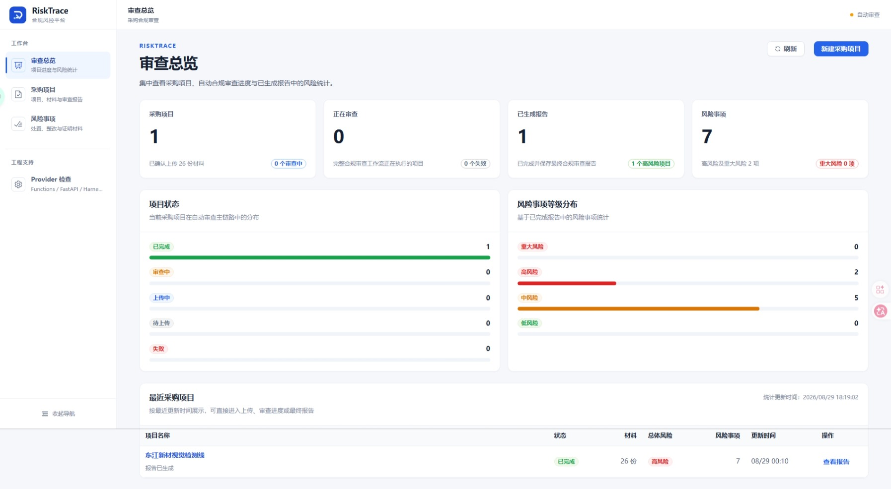
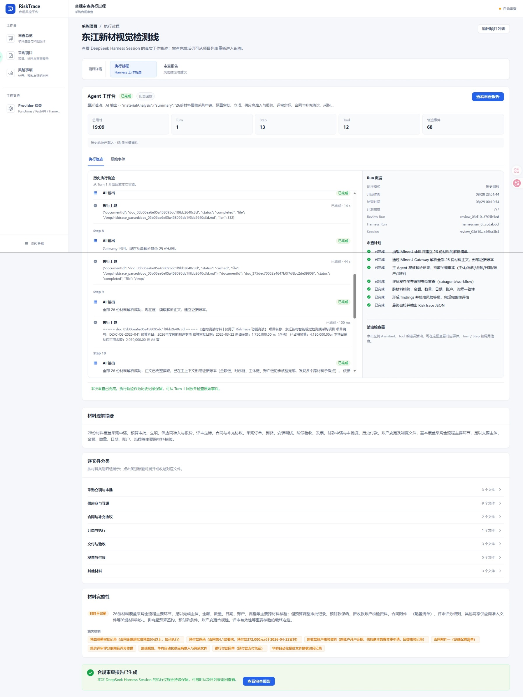
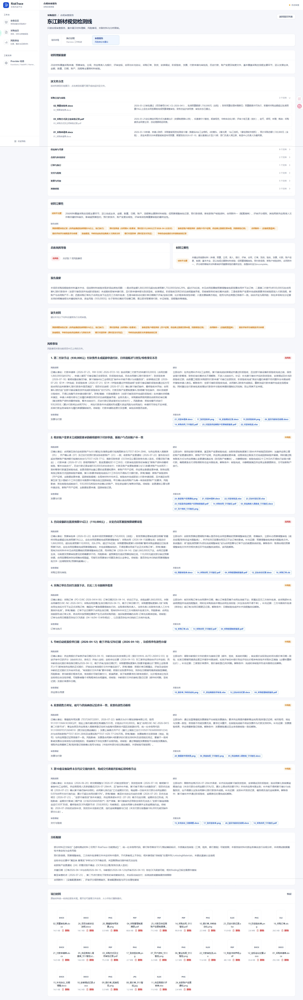

# RiskTrace

RiskTrace 是面向企业采购项目的智能合规审查与风险事项处置 Demo。用户创建采购项目并一次性上传当前已有材料后，系统只创建一个 DeepSeek Harness Run；Cloudflare Pages Functions 持续读取同一个 Run 的状态与 Session Event，并在 Harness root turn 明确完成后保存材料理解结果和合规审查报告。报告中的风险事项会幂等同步到独立风险事项页面，用户可手工完成基础处置、整改和证明材料留存。

DeepSeek Harness 是当前唯一 Agent Runtime。风险事项处置闭环本身不调用 AI。

> 仓库地址：https://github.com/DannyWongIsAvailable/RiskTrace.git  
> 线上地址：https://risktrace.pages.dev/  
> DeepSeek Harness Python SDK 官方文档：https://deepseek-harness.github.io/deepseek-harness/guide/python-sdk

---




## 1. 当前 MVP 范围

当前前端主链为：

```text
审查总览
→ 采购项目列表
→ 新建采购项目
→ 上传材料
→ 合规审查执行过程
→ 合规审查报告
→ 风险事项处置与整改
```

当前版本已经实现：

- 创建采购项目时只填写项目标题；
- 一次选择并上传全部已有材料；
- 文件直接上传私有 Cloudflare R2；
- 上传完成后自动创建一个 RiskTrace `reviewRun`；
- 一个审查尝试只创建一个 DeepSeek Harness Run；
- 自动完成材料解析、材料理解、自动分类、完整性判断、领域审查和报告聚合；
- Harness 执行期间增量展示真实 Session Event 工作轨迹；
- 审查完成后保留 Session Trajectory 供历史追溯；
- Pages Functions 对 Harness 输出做结构、枚举、长度和文档归属校验后写入 D1；
- 最终报告中的 `findings` 幂等同步到 `risk_findings`；
- 风险事项支持填写处置方式、责任人、整改措施、整改说明和整改完成时间；
- 至少上传一份证明材料到私有 R2 后，可将风险事项提交为已完成。

当前版本暂不实现：

- 复杂逐字段事实表和精细证据模型；
- 规则配置中心；
- 复杂组织、角色和权限体系；
- 全量外部商业数据接口。

---

## 2. 核心业务链路

```text
用户填写项目标题
→ 一次性上传全部材料
→ 浏览器通过预签名 PUT URL 直传私有 R2
→ 上传确认后创建一个 RiskTrace review run
→ Pages Functions 创建且只创建一个 DeepSeek Harness Run
→ ECS FastAPI 将异步任务写入 SQLite 并提交 RunManager
→ DeepSeek Harness root Agent 解析材料并执行采购合规审查
→ FastAPI 持久化完整 Harness Session Event
→ Vue 增量读取 /review/events 并 replay Turn / Step / Tool / Assistant / Todo
→ Harness root turn completed
→ ECS 归一化 materialAnalysis + finalReport
→ Pages Functions 再次执行业务校验
→ D1 保存材料理解和最终报告
→ findings 幂等同步为风险事项
→ 用户手工完成处置、整改和 R2 证明材料留存
```


一个审查尝试只允许一个 Harness Run。状态查询与 Event replay 始终复用同一个 `provider_execute_id`，轮询不得创建第二次执行。

---

## 3. 领域术语

| 业务概念 | 界面名称 | 代码命名 |
|---|---|---|
| 顶层业务对象 | 采购项目 | `project` / `Project` / `projectId` |
| 一次自动化审查过程 | 合规审查 | `review` / `reviewRun` / `reviewRunId` |
| Harness 单次异步执行 | Harness Run | `providerExecuteId` / `executeId` / `runId` |
| Harness 原生会话 | Harness Session | `sessionId` |
| 材料理解中间输出 | 材料理解结果 | `materialAnalysis` |
| 最终检出结果 | 风险事项 | `riskFinding` / `RiskFinding` / `findingId` |
| 最终聚合输出 | 合规审查报告 | `reviewReport` / `ReviewReport` / `finalReport` |

“风险发现”只用于描述识别动作，不作为实体名称；“标案”“采购事件”“风险事件”和 `case` 不作为新功能命名。

需要特别区分：

- `reviewRunId` 是 RiskTrace 业务层稳定 ID；
- `provider_execute_id` / Harness `runId` 是 ECS 异步执行 ID；
- Harness `sessionId` 是 SDK/runtime 的原生会话 ID；
- 当前代码每次 `/runs` 执行都会创建新的 Harness `sessionId`，避免重试时与历史持久化 Session 冲突。

---

## 4. 系统架构

```text
┌──────────────────────────────────────────────────────────────┐
│                        Browser / Vue 3                       │
└──────────────────────────────┬───────────────────────────────┘
                               │ RiskTrace REST API
                               ▼
┌──────────────────────────────────────────────────────────────┐
│                Cloudflare Pages Functions                   │
│                                                              │
│  D1: project / document / review / result / risk_findings    │
│  R2: original files / evidence attachments / derived files   │
│  DeepSeekHarnessReviewProvider: Harness HTTP adapter          │
└──────────────────────────────┬───────────────────────────────┘
                               │
                 POST /runs / GET /runs/{id}
                 GET /runs/{id}/events
                               │
                               ▼
┌──────────────────────────────────────────────────────────────┐
│            Alibaba Cloud ECS / FastAPI Harness Service       │
│                                                              │
│  RunManager + ThreadPoolExecutor                             │
│  runs.sqlite3 + run_events                                   │
│  DeepSeek Harness Python SDK                                 │
└──────────────────────────────┬───────────────────────────────┘
                               │ JSON-RPC stdio / bundled runtime
                               ▼
┌──────────────────────────────────────────────────────────────┐
│                   DeepSeek Harness Session                  │
│                                                              │
│  Root Agent / Todo / Goal / Subagent / Workflow / Web        │
│  Bash / FS / Editor / Skills / Context Compaction            │
│                                                              │
│                         MinerU Skill                          │
└──────────────────────────────┬───────────────────────────────┘
                               │ 127.0.0.1:18000
                               ▼
┌──────────────────────────────────────────────────────────────┐
│                       MinerU Gateway                         │
│              URL-native precise document parsing            │
└──────────────────────────────┬───────────────────────────────┘
                               │
                               ▼
                         MinerU Official API
```

Pages Functions 负责项目创建、上传编排、R2 短时访问、创建唯一 Harness Run、状态同步、事件安全投影、模型结果校验、幂等保存和稳定 API 输出。

浏览器不会直接访问 Harness Base URL、Harness API Key、DeepSeek API Key 或 MinerU API Key。

---

## 5. 文件上传与文档解析链路

### 5.1 R2 上传

项目材料通过预签名 URL 直接上传私有 Cloudflare R2：

```text
Browser
→ POST /api/projects/:projectId/upload-sessions
→ Pages Functions 生成 R2 预签名 PUT URL
→ Browser 直接 PUT R2
→ POST document complete
→ Pages Functions HEAD R2 校验大小/可选 SHA-256
```

当前代码约束：

- 单项目最多 30 份材料；
- 单文件最大 50 MiB；
- 单项目材料总大小最大 200 MiB；
- 上传 PUT URL 有效期 15 分钟；
- 提交给 Harness 的 R2 GET URL 有效期 2 小时；
- 压缩包不支持直接上传，应先解压；
- 支持 PDF、常见图片、Office 文档、CSV、TXT、Markdown 和 JSON。

### 5.2 Harness 获取材料

Pages Functions 不把文件正文 POST 给 Harness，而是为已上传文件生成短时 R2 GET 签名 URL：

```json
{
  "documentId": "doc_xxx",
  "fileName": "采购合同.pdf",
  "mimeType": "application/pdf",
  "fileUrl": "<R2 presigned GET URL>",
  "parseStrategy": "ocr"
}
```

`parseStrategy` 当前由文件扩展名推导：

- Excel / CSV → `table`；
- TXT / Markdown / JSON → `text`；
- 其他已支持格式 → `ocr`。

### 5.3 MinerU URL-native 解析

RiskTrace 自定义 `mineru` skill 要求 Agent 优先把输入中的原始 `fileUrl` 直接交给本机 MinerU Gateway：

```text
Harness Agent
→ POST http://127.0.0.1:18000/parse-url
→ MinerU Gateway
→ MinerU 官方 URL-native API
→ Markdown
→ Agent 建立证据底座并继续审查
```

关键约束：

- Harness 不持有 `MINERU_API_KEY`；
- `MINERU_API_KEY` 只由 `risktrace-mineru` 服务持有；
- 有 `fileUrl` 时不主动把源文件下载到 ECS 本地；
- 同一材料原则上只解析一次；
- MinerU 返回的 Markdown 是“提取证据”，不是风险结论；
- 文档解析失败时不得编造正文，最终结果应明确进入能力降级/限制说明。

---

## 6. DeepSeek Harness：已部署 ECS 服务

RiskTrace 使用独立部署在阿里云 ECS 上的 DeepSeek Harness 服务。该服务不属于 Cloudflare Pages Runtime，而是 RiskTrace 的外部 Agent Runtime Gateway。

### 6.1 当前部署信息

| 项目 | 当前实现 |
|---|---|
| ECS 系统 | Alibaba Cloud Linux 3 |
| 部署目录 | `/opt/apps/deepseek-harness` |
| Python | 项目要求 `>=3.12` |
| FastAPI 服务 | `risktrace-fastapi` |
| FastAPI 本机端口 | `127.0.0.1:8000` |
| MinerU Gateway | `risktrace-mineru` |
| MinerU 本机端口 | `127.0.0.1:18000` |
| 外网入口 | Cloudflare Quick Tunnel |
| Tunnel systemd | `cloudflared-quick` |
| Harness SDK | `deepseek-harness-sdk>=0.1.1rc1` |
| Harness provider | 默认 `deepseek-official` |
| Harness model | 默认 `deepseek-v4-flash` |
| FastAPI 应用版本 | `0.2.0` |
| 默认并发 | `HARNESS_MAX_CONCURRENCY=1` |
| 异步 Run 数据库 | `data/runs.sqlite3` |
| Harness Session | `sessions/` |
| Agent workspace | `workspace/` |
| Cordis composition | `risktrace-review-cordis.yaml` |

> 官方 Python SDK 要求独立任务使用新的 `session_id`。当前 RiskTrace 实现每个 Harness Run 都创建新的原生 Session ID，而不是直接复用业务 `reviewRunId`。

### 6.2 ECS 服务组成

ECS 当前长期运行三个 systemd 服务：

```text
Cloudflare Pages
       │
       ▼
Cloudflare Quick Tunnel
       │
       ▼
risktrace-fastapi :8000
       │
       ├──────────────→ DeepSeek Harness Python SDK / Runtime
       │
       └──────────────→ risktrace-mineru :18000
                               │
                               ▼
                         MinerU Official API
```

| systemd 服务 | 作用 |
|---|---|
| `risktrace-fastapi` | 接收 RiskTrace Harness HTTP 请求、管理异步 Run、调用 DeepSeek Harness SDK |
| `risktrace-mineru` | 为 Harness 提供固定的本机文档解析接口并持有 MinerU Token |
| `cloudflared-quick` | 将本机 FastAPI 暴露为 `https://*.trycloudflare.com` |

### 6.3 FastAPI 对外契约

RiskTrace Pages Functions 当前只依赖以下核心接口：

| 方法 | 路径 | 说明 |
|---|---|---|
| `POST` | `/runs` | 创建或幂等获取异步 Harness Run，成功返回 `202` |
| `GET` | `/runs/{runId}` | 查询 Run 快照 |
| `GET` | `/runs/{runId}/events` | 按 `after` 增量读取 Session Event |
| `GET` | `/healthz` | FastAPI 健康检查 |
| `GET` | `/diagnostics/async-contract` | 低成本异步契约检查，不启动模型 |
| `POST` | `/diagnostics/provider-check` | 真正启动一次最小 Harness 调用做端到端检查 |

`POST /runs` 请求体固定使用：

```json
{
  "contract": "risktrace.review.v1",
  "idempotencyKey": "<reviewRunId>:attempt:<attemptNo>",
  "project": {
    "projectId": "...",
    "reviewRunId": "...",
    "projectTitle": "..."
  },
  "files": []
}
```

Run 状态为：

```text
queued → running → completed
                 ↘ failed
```

RiskTrace 只把 Harness root turn 的明确 `completed` 当作成功；`error`、`aborted`、`blocked`、`interrupted`、`max_tokens` 等终止原因不会被伪装成成功。

### 6.4 异步 Run 与事件持久化

FastAPI 使用 `RunManager + ThreadPoolExecutor + SQLite` 将耗时 Harness 执行与 HTTP 请求解耦。

```text
POST /runs
→ SQLite create_or_get(idempotencyKey)
→ queued
→ ThreadPoolExecutor
→ running
→ DeepSeekHarness.run(...)
→ completed / failed
```

SQLite 同时持久化：

- Run 请求与状态；
- 归一化后的业务输出；
- `finalResponse`；
- Harness 诊断元数据；
- 完整 Session Event；
- `(run_id, seq)` 增量事件序列。

Harness SDK 的 `on_notification` 用于实时接收事件；执行结束后，`result.events` 还会用于补齐事件，降低实时通知遗漏导致轨迹不完整的风险。

FastAPI 支持两种事件视图：

- `view=raw`：完整持久化事件；
- `view=trajectory`：只投影 UI 需要的 Turn / Step / Assistant / Tool / Todo 等轨迹事件。

Pages Functions 在返回浏览器前还会执行第二层安全过滤，避免 reasoning、System Prompt、密钥、R2 签名 URL 等内部信息直接暴露到前端。

### 6.5 Harness Python SDK 调用

当前核心调用位于 ECS 服务 `app/services/harness_service.py`：

```python
with DeepSeekHarness(
    provider=settings.harness_provider,
    model=settings.harness_model,
    cwd=str(settings.harness_workspace),
    session_root=str(settings.harness_session_root),
    api_key=api_key,
    base_url=settings.deepseek_base_url,
    cordis=settings.harness_cordis,
) as harness:
    result = harness.run(
        prompt,
        session_id=harness_session_id,
        on_notification=on_notification,
    )
```

其中：

- `cwd` 对应 Agent 可访问的工作目录；
- `session_root` 对应 Harness 持久会话目录；
- `cordis` 指向 RiskTrace 自定义 Agent composition；
- `session_id` 每个 Run 新建；
- 当前 FastAPI 调用层没有显式传入 `max_tokens`，相关限制由 Harness/runtime/model 配置决定。

### 6.6 当前 Cordis Agent 能力

`risktrace-review-cordis.yaml` 并非官方 minimal composition。当前 RiskTrace 已挂载：

- DeepSeek LLM adapter，thinking 开启、reasoning effort 为 `max`；
- Bash，本地执行超时 60 秒；
- 本地 filesystem；
- Session persistence，生产使用 zstd 压缩；
- session checkpoint；
- Todo；
- Goal；
- Subagent；
- Workflow；
- DeepSeek Web Search；
- filesystem search；
- `str_replace_editor`；
- Skill Registry 与 filesystem skill provider；
- RiskTrace 自定义 MinerU skill；
- token meter；
- context compaction。

RiskTrace 的 root Agent 是最终责任主体。Subagent / Workflow 输出只能作为候选分析，最终事实和 finding 必须回到已解析原始材料进行核验。

### 6.7 Harness 输出结构

Harness root Agent 最终必须输出一个可解析 JSON 对象，同时包含：

```text
materialAnalysis
finalReport
```

ECS FastAPI 先执行一层解析与归一化；随后 Pages Functions 再执行第二层业务校验，只有两部分全部通过后才保存到 D1。

核心原则：

```text
LLM final response
→ ECS JSON 提取
→ ECS 枚举/长度/文档引用归一化
→ Pages JSON 解析
→ Pages MaterialAnalysis 校验
→ Pages ReviewReport 校验
→ D1
```

模型输出不能直接写业务数据库。

---

## 7. Harness ECS 目录

独立 Harness 服务的当前代码结构：

```text
/opt/apps/deepseek-harness/
├─ app/
│  ├─ api/
│  │  ├─ runs.py                 # /runs 与 /events
│  │  └─ diagnostics.py          # async-contract / provider-check
│  ├─ core/
│  │  └─ config.py               # pydantic-settings
│  ├─ services/
│  │  ├─ harness_service.py      # Prompt、SDK 调用、输出归一化
│  │  └─ run_manager.py          # 异步执行、事件回放、清理
│  ├─ storage/
│  │  └─ run_store.py            # SQLite async_runs / run_events
│  └─ skills/
│     └─ mineru/SKILL.md         # RiskTrace MinerU skill
├─ data/
│  └─ runs.sqlite3               # FastAPI 异步 Run 与事件
├─ sessions/                     # Harness Session 持久化
├─ workspace/                    # Agent 工作目录
├─ mineru-gateway.py             # MinerU 本机 Gateway
├─ risktrace-review-cordis.yaml  # Harness Cordis composition
├─ pyproject.toml
└─ .env                          # ECS Harness 配置；不得提交密钥
```

`workspace/`、`sessions/`、`data/` 都属于运行时数据，不应作为源代码提交。

---

## 8. Harness ECS 配置

### 8.1 FastAPI / Harness 环境变量

| 环境变量 | 用途 | 默认/说明 |
|---|---|---|
| `DEEPSEEK_API_KEY` | DeepSeek API 凭据 | 生产必需，Secret |
| `DEEPSEEK_BASE_URL` | DeepSeek 兼容 API Base URL | 可选 |
| `HARNESS_PROVIDER` | Harness provider | 默认 `deepseek-official` |
| `HARNESS_MODEL` | Harness model | 默认 `deepseek-v4-flash` |
| `HARNESS_CORDIS` | Cordis 配置文件 | 部署时应指向 `risktrace-review-cordis.yaml` |
| `DSH_HOME` | Harness home | 默认项目 `.dsh` |
| `HARNESS_WORKSPACE` | Agent workspace | 默认项目 `workspace/` |
| `HARNESS_SESSION_ROOT` | Session 持久目录 | 默认项目 `sessions/` |
| `HARNESS_RUN_DB` | FastAPI Run SQLite | 默认 `data/runs.sqlite3` |
| `HARNESS_MAX_CONCURRENCY` | 同时执行的 Harness Run 数 | 默认 `1` |
| `HARNESS_RESULT_RETENTION_HOURS` | terminal Run/Event 清理保留时间 | 默认 `72` 小时 |
| `HARNESS_API_KEY` | FastAPI Bearer Token | 可选；配置后强制鉴权 |
| `MINERU_GATEWAY_URL` | MinerU Gateway 配置项 | 默认 `http://127.0.0.1:18000` |

注意：当前 `mineru/SKILL.md` 中调用地址仍固定为 `http://127.0.0.1:18000`，因此仅修改 `MINERU_GATEWAY_URL` 并不会同步改变 skill 中的实际请求地址；如需迁移端口，应同时修改 skill 或进一步统一配置来源。

`HARNESS_STALE_RUN_SECONDS` 目前在 Settings 中存在，但当前启动恢复逻辑没有按该值计算 stale threshold；FastAPI 启动时会直接将前一进程遗留的 `queued/running` Run 标记为失败。不要把该变量理解为已经生效的超时控制。

### 8.2 MinerU Gateway 环境变量

核心配置：

| 环境变量 | 用途 |
|---|---|
| `MINERU_API_KEY` | MinerU 官方 API Token，仅由 Gateway 持有 |
| `MINERU_API_BASE` | MinerU API Base URL，默认 `https://mineru.net` |
| `GATEWAY_HOST` | 默认 `127.0.0.1` |
| `GATEWAY_PORT` | 默认 `18000` |
| `SYNC_WAIT_TIMEOUT` | `/parse-url` 最长同步等待时间，默认 50 秒 |
| `POLL_INTERVAL` | Gateway 轮询 MinerU 的间隔，默认 2 秒 |

---

## 9. Cloudflare Pages ↔ Harness 配置

Pages Functions 使用 `DeepSeekHarnessReviewProvider` 访问 ECS。

当前执行后端已经固定为 DeepSeek Harness：

- `createConfiguredReviewProvider()` 永远返回 `DeepSeekHarnessReviewProvider`；
- `REVIEW_PROVIDER` 不再参与运行时选择；
- `XFYUN_*` 字段仍存在于部分类型或部署配置中，仅属于历史兼容残留，不参与当前审查执行链路。

Harness 相关 Pages 配置：

| 变量 | 说明 |
|---|---|
| `DEEPSEEK_HARNESS_BASE_URL` | ECS FastAPI 外部 Base URL |
| `DEEPSEEK_HARNESS_API_KEY` | 可选 Bearer Token；应与 ECS `HARNESS_API_KEY` 一致 |

浏览器不会读取这两个值，调用只发生在 Pages Functions 服务端。

### Quick Tunnel 注意事项

当前 ECS 外网入口使用 Cloudflare Quick Tunnel。Quick Tunnel 重建后 hostname 可能变化，因此需要检查：

```bash
curl http://127.0.0.1:55555/quicktunnel
```

若地址变化，应同步更新 Pages 的 `DEEPSEEK_HARNESS_BASE_URL` 并重新部署。

`wrangler.jsonc` 当前保存了一个具体 `trycloudflare.com` 地址，因此部署前必须确认它仍是当前有效 Tunnel；长期生产环境建议换成稳定域名/Tunnel，避免 Base URL 随 Quick Tunnel 重启变化。

---

## 10. Harness 运维

### 10.1 查看服务状态

```bash
systemctl status \
  risktrace-fastapi \
  risktrace-mineru \
  cloudflared-quick
```

### 10.2 查看开机启动

```bash
systemctl is-enabled \
  risktrace-fastapi \
  risktrace-mineru \
  cloudflared-quick
```

### 10.3 重启

```bash
sudo systemctl restart risktrace-fastapi
sudo systemctl restart risktrace-mineru
sudo systemctl restart cloudflared-quick
```

### 10.4 日志

```bash
journalctl -u risktrace-fastapi -f
journalctl -u risktrace-mineru -f
journalctl -u cloudflared-quick -f
```

查看最近 100 行：

```bash
journalctl -u risktrace-fastapi -n 100 --no-pager
journalctl -u risktrace-mineru -n 100 --no-pager
journalctl -u cloudflared-quick -n 100 --no-pager
```

### 10.5 本机健康检查

FastAPI：

```bash
curl http://127.0.0.1:8000/healthz
```

异步契约：

```bash
curl http://127.0.0.1:8000/diagnostics/async-contract
```

MinerU：

```bash
curl http://127.0.0.1:18000/health
```

若配置了 `HARNESS_API_KEY`，需要为受保护的 Harness 接口增加：

```text
Authorization: Bearer <HARNESS_API_KEY>
```

### 10.6 常见故障定位

FastAPI：

```bash
ss -lntp | grep 8000
journalctl -u risktrace-fastapi -n 100 --no-pager
```

MinerU：

```bash
ss -lntp | grep 18000
journalctl -u risktrace-mineru -n 100 --no-pager
```

Quick Tunnel：

```bash
journalctl -u cloudflared-quick -n 100 --no-pager
curl http://127.0.0.1:55555/quicktunnel
```

如果前端 Provider Check 失败，优先按以下顺序检查：

```text
1. FastAPI /healthz
2. FastAPI /diagnostics/async-contract
3. 当前 Quick Tunnel hostname
4. Pages DEEPSEEK_HARNESS_BASE_URL
5. Pages DEEPSEEK_HARNESS_API_KEY 与 ECS HARNESS_API_KEY 是否一致
6. /diagnostics/provider-check 是否能真正完成最小模型调用
7. DeepSeek API Key / provider / model
```

---

## 11. Session Event 与前端 Trajectory

Harness Gateway 会把 Session Event 以 append-only 方式持久化到 SQLite `run_events`，事件序号 `seq` 用于稳定增量回放。

前端执行过程页不会从日志文本猜 Agent 状态，而是读取：

```text
GET /api/projects/:projectId/review/events
```

Pages Functions 再代理：

```text
GET /runs/{providerExecuteId}/events?after=<seq>&limit=<n>&view=<raw|trajectory>
```

`trajectory` 目前保留的核心 event type 包括：

```text
turn/start
step/start
assistant/message
tool/call
tool/code-dispatch-start
tool/result
tool/code-dispatch
todo/write
step/end
turn/end
```

执行完成后仍保留历史事件，用户重新进入 `/projects/:projectId/review` 时可以从 `seq=-1` 重放完整轨迹。

---

## 12. RiskTrace 技术栈

### 前端

- Vue 3
- TypeScript
- Vite
- Vue Router
- Pinia
- Element Plus
- Element Plus Icons
- UnoCSS
- 原生 Fetch 统一封装

### Cloudflare

- Cloudflare Pages
- Cloudflare Pages Functions
- Cloudflare Workers Runtime
- Cloudflare D1
- Cloudflare R2
- Wrangler
- D1 Migrations

### Agent Runtime / ECS

- Python 3.12+
- FastAPI
- Uvicorn
- Pydantic Settings
- DeepSeek Harness Python SDK
- DeepSeek Harness bundled runtime
- Cordis composition
- SQLite
- MinerU Gateway
- systemd
- Cloudflare Quick Tunnel

---

## 13. RiskTrace 页面与路由

| 路由 | 页面 | 说明 |
|---|---|---|
| `/dashboard` | 审查总览 | 展示项目状态、审查进度、报告与风险事项统计 |
| `/projects` | 采购项目列表 | 查询项目和进入新建流程 |
| `/projects/new` | 新建采购项目 | 填写项目标题并一次性上传材料 |
| `/projects/:projectId/upload` | 项目材料上传 | 选择并上传项目材料 |
| `/projects/:projectId/review` | 合规审查执行过程 | 实时/历史回放 Harness Session Event，并展示材料理解结果 |
| `/projects/:projectId/report` | 合规审查报告 | 展示最终风险报告和关联文件 |
| `/risk-findings` | 风险事项 | 查看全部风险事项并完成基础处置、整改和证明材料留存 |
| `/foundation` | 设计系统 | 开发环境基础组件预览 |

当前 Demo 风险事项状态固定为“待处置与整改”和“已完成”两个状态，不包含 AI 复核、多级审批和关闭回退。

---

## 14. RiskTrace 目录约定

```text
src/views/              路由级页面
src/layouts/            应用壳层
src/components/common/  通用基础组件
src/components/<domain> 领域复用组件
src/api/modules/        类型化前端 API
src/stores/             跨路由共享状态
src/types/              跨模块类型
src/constants/          稳定配置和枚举映射
src/icons/              图标统一出口
src/mocks/              明确标识的演示数据
src/styles/             全局设计系统
functions/api/          Pages Functions REST API
functions/_shared/      Provider、Repository、校验、R2、审查服务等共享能力
migrations/             D1 migrations
docs/                   工程规范、设计规范和赛题材料
```

当前可直接参考：

- `AGENTS.md`：AI 与人工开发必须遵守的工程契约；
- `AI_FRONTEND_STANDARD.md`：前端开发速查；
- `docs/API_CONVENTIONS.md`：接口规范；
- `docs/ERROR_HANDLING_AND_OBSERVABILITY.md`：错误处理与观测；
- `docs/FILE_STRUCTURE.md`：目录职责；
- `docs/FRONTEND_DESIGN_SYSTEM.md`：设计系统；
- `docs/ICON_SYSTEM.md`：图标规范；
- `docs/r2-cors.example.json`：R2 CORS 示例。

---

## 15. 本地开发

### 环境要求

- Node.js：`^22.18.0 || >=24.12.0`；
- 包管理器：pnpm；
- Cloudflare 本地联调：Wrangler。

安装依赖：

```bash
pnpm install
```

启动纯前端开发环境：

```bash
pnpm dev
```

联调 Pages Functions 与 Cloudflare 资源：

```bash
pnpm cf:dev
```

---

## 16. 质量检查与构建

执行完整检查：

```bash
pnpm check
```

包含：

- Vue / 前端 TypeScript 类型检查；
- Pages Functions TypeScript 类型检查；
- OXLint；
- ESLint；
- Prettier；
- Vite build。

单独构建：

```bash
pnpm build
```

---

## 17. D1、R2 与 Cloudflare 部署

创建迁移：

```bash
pnpm db:migration:create <migration-name>
```

应用本地迁移：

```bash
pnpm db:migrate:local
```

应用远程迁移：

```bash
pnpm db:migrate:remote
```

查看迁移：

```bash
pnpm db:list:local
pnpm db:list:remote
```

应用 R2 CORS：

```bash
pnpm r2:cors:apply
```

部署 Pages：

```bash
pnpm cf:deploy
```

当前风险事项功能依赖：

```text
migrations/0003_risk_findings_workflow.sql
```

部署包含风险事项功能的新代码前，应先执行远程 D1 migration，再部署 Pages，避免新接口访问尚未创建的数据表。

---

## 18. 核心工程规则

- 顶层业务对象统一使用“采购项目”和 `project`；
- DeepSeek Harness 是当前唯一 Agent Runtime；
- `REVIEW_PROVIDER` 不得重新被用于生产运行时分支；
- 一个审查尝试只启动一次从材料理解贯通到最终报告的 Harness Run；
- 不得为材料理解和领域审查分别创建两个 Harness Run；
- 一次 `/uploads/complete` 只允许一次 `POST /runs`；
- 重试通过相同 RiskTrace `reviewRunId` 的下一 `attemptNo` 生成新的幂等键和新的 Harness Run；
- Harness root turn 必须明确 `completed` 才允许进入结果保存；
- `materialAnalysis` 与 `finalReport` 两部分必须完整校验；
- 模型输出不能直接写 D1；
- Subagent / Workflow 输出不是原始证据；
- 模型不得修改项目标题、文件名、`documentId`、R2 Key 或系统状态；
- Vue 组件和 Pinia Store 不得直接调用 `fetch`；
- 浏览器请求统一经过 `src/api/request.ts` 与 `src/api/modules/`；
- 前端不得直接访问 D1、R2 或 Harness；
- 风险事项处置与整改由用户手工提交，当前不调用 AI；
- 风险事项证明材料必须先上传 R2 并完成确认，再允许标记为已完成；
- 密钥、签名 URL、System Prompt、私有 reasoning 和 Harness 内部配置不得输出到浏览器日志；
- `DEEPSEEK_API_KEY`、`MINERU_API_KEY`、`HARNESS_API_KEY`、R2 Secret 等不得提交到仓库；
- 演示数据只能放在 `src/mocks/` 或明确的演示模块；
- 数据页面必须覆盖 loading、success、empty 和 error 状态；
- 不得引入第二套 UI 框架、状态库或 HTTP 客户端。

---

## 19. 已知部署注意事项

### Quick Tunnel 不是稳定生产入口

当前外部入口是 `trycloudflare.com` Quick Tunnel，hostname 可能在重建后变化。若页面突然无法访问 Harness，应首先检查 Tunnel hostname 与 Pages `DEEPSEEK_HARNESS_BASE_URL` 是否一致。

### R2 审查 URL 有 2 小时有效期

Harness 输入中的文件 URL 是短时 R2 GET 签名。如果 Run 长时间排队超过 URL 有效期，MinerU 后续读取可能失败。当前默认 `HARNESS_MAX_CONCURRENCY=1`，大量并发项目时需要关注这一边界。

### FastAPI 进程重启会中断正在执行的 Run

Harness Run 由当前 FastAPI 进程内 `ThreadPoolExecutor` 执行。服务重启后，上一进程中的任务不会自动恢复；启动恢复逻辑会把遗留的 `queued/running` Run 标记为失败并保留历史 Event，业务侧可走重试流程。

### Runtime 当前按 Run 创建

`run_review_detailed()` 每次执行都会进入新的 `DeepSeekHarness(...)` context，因此当前不是一个长期驻留、跨 Run 复用的 Harness runtime。独立 Run 使用独立 session，行为清晰，但会承担 runtime 启停成本。

### Provider Check 与正式审查的 Cordis 路径不同

正式审查会传入 `settings.harness_cordis`；当前最小 `/diagnostics/provider-check` 只验证 SDK/runtime/model 基础连通性，并未传入 RiskTrace Cordis composition。因此 Provider Check 成功不代表 MinerU skill、workflow/subagent 等正式审查能力全部正常。

---

## 20. 官方 DeepSeek Harness 参考

当前实现主要依据 DeepSeek Harness Python SDK 和 Cordis 插件组合机制：

- Python SDK：<https://deepseek-harness.github.io/deepseek-harness/guide/python-sdk>
- Harness 架构：<https://deepseek-harness.github.io/deepseek-harness/reference/>
- Cordis 入门：<https://deepseek-harness.github.io/deepseek-harness/reference/cordis-primer>
- Plugin Config Catalog：<https://deepseek-harness.github.io/deepseek-harness/reference/config-catalog>
- Subagent：<https://deepseek-harness.github.io/deepseek-harness/reference/subsystems/subagent>
- Workflow：<https://deepseek-harness.github.io/deepseek-harness/reference/subsystems/workflow>
- Skills：<https://deepseek-harness.github.io/deepseek-harness/en/reference/subsystems/skills>

---

## 21. 安全说明

- 浏览器只访问 RiskTrace API，不直接访问 ECS Harness；
- R2 原始材料与风险事项证明材料保持私有；
- 文件通过短时预签名 URL 上传/读取；
- Harness API 支持 Bearer 鉴权，生产环境应配置 `HARNESS_API_KEY` / `DEEPSEEK_HARNESS_API_KEY`；
- MinerU Token 仅存在于 MinerU Gateway 服务环境中；
- DeepSeek API Key 仅存在于 ECS Harness 服务环境中；
- Session Event 返回浏览器前必须经过安全投影；
- 不得在 README、代码、日志、前端构建产物或 Git 历史中保存任何真实 Secret。
